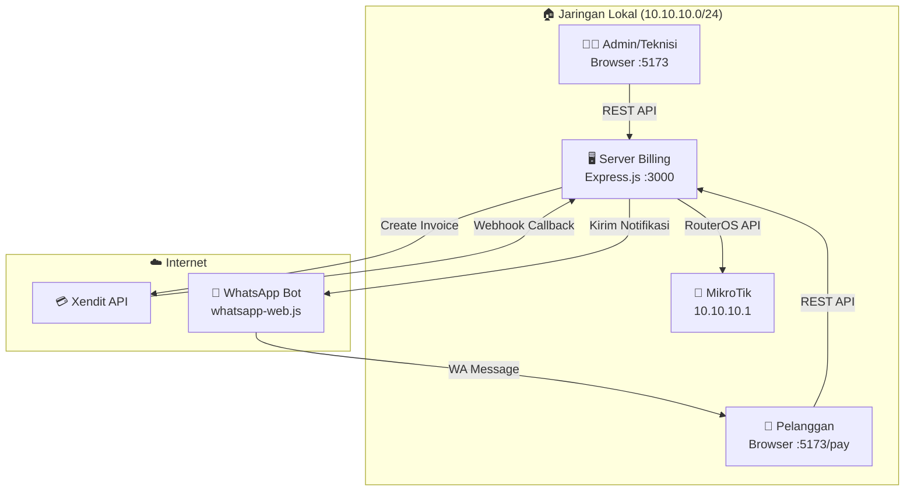
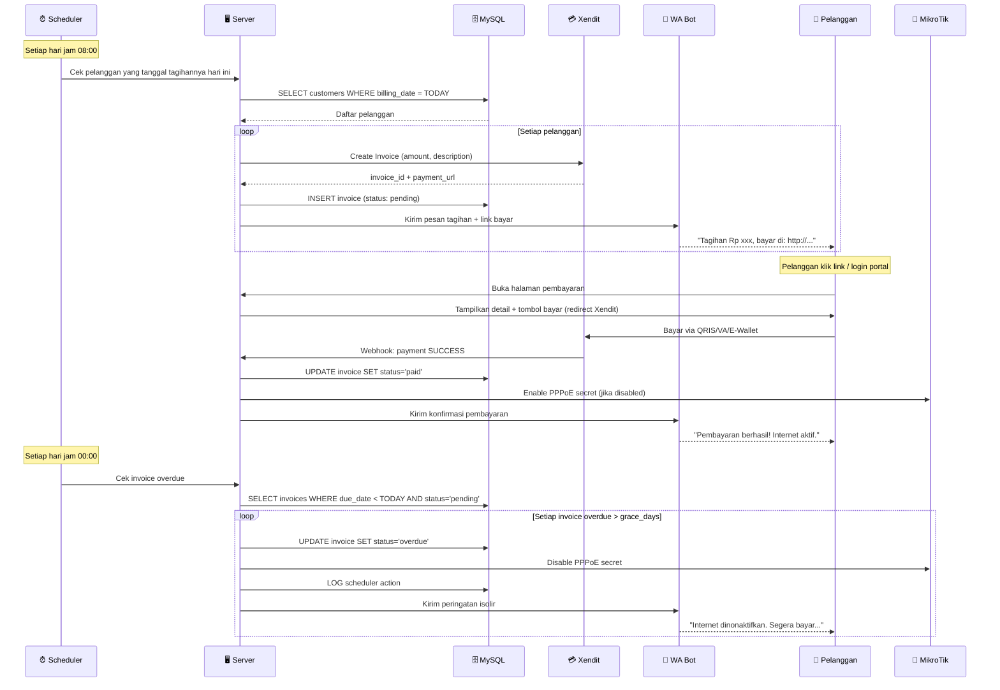

# 🏗️ Rancangan Arsitektur Billing RT/RW Net

## Ringkasan Sistem

Sistem billing terintegrasi untuk ISP RT/RW Net berbasis MikroTik, berjalan di **local server** dalam 1 jaringan. Pelanggan membayar via **Xendit Payment Gateway**, menerima notifikasi via **WhatsApp Bot**, dan PPPoE akan otomatis aktif/non-aktif berdasarkan status pembayaran.

---

## 📐 Arsitektur Umum



---

## 👥 Role & Interface

### 1️⃣ Admin (Full Access)
| Fitur | Keterangan |
|:---|:---|
| Dashboard Billing | Ringkasan pendapatan, grafik, statistik |
| Kelola Pelanggan | CRUD data pelanggan + PPPoE secret |
| Kelola Paket | CRUD paket internet (profile PPPoE + harga) |
| Invoice Management | Generate, lihat, batalkan invoice |
| Laporan Keuangan | Rekap bulanan, export PDF/Excel |
| Pengaturan | Xendit API key, WhatsApp, template pesan |
| Monitoring | Realtime traffic, status router |

### 2️⃣ Teknisi (Limited Access)
| Fitur | Keterangan |
|:---|:---|
| Daftar Pelanggan | Lihat data pelanggan (read-only billing) |
| PPPoE Management | Enable/disable secret, troubleshoot |
| Monitoring | Realtime traffic, status router |
| Tiket Support | Kelola keluhan pelanggan |

### 3️⃣ Pelanggan (Self-Service Portal)
| Fitur | Keterangan |
|:---|:---|
| Status Langganan | Paket aktif, masa berlaku, sisa hari |
| Riwayat Pembayaran | Daftar invoice & status bayar |
| Pembayaran | Halaman payment via Xendit |
| Profil | Ubah password, lihat info akun |

> [!IMPORTANT]
> Pelanggan hanya bisa akses portal jika terhubung ke jaringan WiFi lokal (10.10.10.x atau 10.10.30.x). Ini di-enforce via MikroTik IP binding + firewall.

---

## 🗄️ Database Schema (MySQL)

```sql
-- ========================================
-- TABEL USERS (Login System)
-- ========================================
CREATE TABLE users (
  id INT AUTO_INCREMENT PRIMARY KEY,
  username VARCHAR(50) UNIQUE NOT NULL,
  password VARCHAR(255) NOT NULL,  -- bcrypt hash
  role ENUM('admin', 'teknisi', 'pelanggan') DEFAULT 'pelanggan',
  customer_id INT NULL,            -- link ke tabel customers (untuk role pelanggan)
  is_active BOOLEAN DEFAULT TRUE,
  created_at TIMESTAMP DEFAULT CURRENT_TIMESTAMP,
  updated_at TIMESTAMP DEFAULT CURRENT_TIMESTAMP ON UPDATE CURRENT_TIMESTAMP
);

-- ========================================
-- TABEL CUSTOMERS (Data Pelanggan)
-- ========================================
CREATE TABLE customers (
  id INT AUTO_INCREMENT PRIMARY KEY,
  name VARCHAR(100) NOT NULL,           -- Nama lengkap
  phone VARCHAR(20) NOT NULL,           -- Nomor WA (format: 628xxx)
  address TEXT,                         -- Alamat pemasangan
  pppoe_username VARCHAR(50) NOT NULL,  -- Link ke PPPoE secret di MikroTik
  router_id INT NOT NULL,              -- Router mana yang dipakai
  package_id INT NOT NULL,             -- Paket internet yang dipilih
  billing_date INT DEFAULT 1,          -- Tanggal tagihan (1-28)
  status ENUM('active','suspended','terminated') DEFAULT 'active',
  join_date DATE NOT NULL,
  notes TEXT,
  created_at TIMESTAMP DEFAULT CURRENT_TIMESTAMP,
  updated_at TIMESTAMP DEFAULT CURRENT_TIMESTAMP ON UPDATE CURRENT_TIMESTAMP,
  FOREIGN KEY (router_id) REFERENCES routers(id),
  FOREIGN KEY (package_id) REFERENCES packages(id)
);

-- ========================================
-- TABEL PACKAGES (Paket Internet = PPPoE Profile + Harga)
-- ========================================
CREATE TABLE packages (
  id INT AUTO_INCREMENT PRIMARY KEY,
  name VARCHAR(50) NOT NULL,            -- "PAKET-3MB"
  pppoe_profile VARCHAR(50) NOT NULL,   -- Nama profile di MikroTik
  speed_up VARCHAR(10) NOT NULL,        -- "3M"
  speed_down VARCHAR(10) NOT NULL,      -- "3M"
  price INT NOT NULL,                   -- Harga per bulan (Rupiah)
  description TEXT,
  is_active BOOLEAN DEFAULT TRUE,
  created_at TIMESTAMP DEFAULT CURRENT_TIMESTAMP
);

-- ========================================
-- TABEL INVOICES (Tagihan Bulanan)
-- ========================================
CREATE TABLE invoices (
  id INT AUTO_INCREMENT PRIMARY KEY,
  invoice_number VARCHAR(20) UNIQUE NOT NULL,  -- "INV-202604-001"
  customer_id INT NOT NULL,
  package_id INT NOT NULL,
  amount INT NOT NULL,                  -- Jumlah tagihan (Rupiah)
  period_start DATE NOT NULL,           -- Awal periode
  period_end DATE NOT NULL,             -- Akhir periode
  due_date DATE NOT NULL,               -- Jatuh tempo
  status ENUM('pending','paid','overdue','cancelled') DEFAULT 'pending',
  xendit_invoice_id VARCHAR(100),       -- ID dari Xendit
  xendit_invoice_url VARCHAR(500),      -- URL pembayaran Xendit
  paid_at TIMESTAMP NULL,
  paid_via VARCHAR(50),                 -- "QRIS", "VA_BCA", dll
  wa_notified BOOLEAN DEFAULT FALSE,    -- Sudah dikirim notif WA?
  wa_notified_at TIMESTAMP NULL,
  created_at TIMESTAMP DEFAULT CURRENT_TIMESTAMP,
  FOREIGN KEY (customer_id) REFERENCES customers(id),
  FOREIGN KEY (package_id) REFERENCES packages(id)
);

-- ========================================
-- TABEL PAYMENT LOG (Riwayat Pembayaran Detail)
-- ========================================
CREATE TABLE payment_logs (
  id INT AUTO_INCREMENT PRIMARY KEY,
  invoice_id INT NOT NULL,
  event_type VARCHAR(50) NOT NULL,     -- "xendit.paid", "manual.paid", "wa.sent"
  raw_data JSON,                       -- Raw webhook/event data
  created_at TIMESTAMP DEFAULT CURRENT_TIMESTAMP,
  FOREIGN KEY (invoice_id) REFERENCES invoices(id)
);

-- ========================================
-- TABEL SCHEDULER LOG (Log Auto Enable/Disable)
-- ========================================
CREATE TABLE scheduler_logs (
  id INT AUTO_INCREMENT PRIMARY KEY,
  customer_id INT NOT NULL,
  action ENUM('disable','enable') NOT NULL,
  reason VARCHAR(200),                 -- "Overdue invoice INV-202604-001"
  success BOOLEAN DEFAULT TRUE,
  error_message TEXT,
  created_at TIMESTAMP DEFAULT CURRENT_TIMESTAMP,
  FOREIGN KEY (customer_id) REFERENCES customers(id)
);

-- ========================================
-- TABEL SETTINGS (Pengaturan Sistem)
-- ========================================
CREATE TABLE settings (
  `key` VARCHAR(50) PRIMARY KEY,
  `value` TEXT NOT NULL,
  updated_at TIMESTAMP DEFAULT CURRENT_TIMESTAMP ON UPDATE CURRENT_TIMESTAMP
);

-- Default Settings
INSERT INTO settings (`key`, `value`) VALUES
  ('xendit_secret_key', ''),
  ('xendit_webhook_token', ''),
  ('wa_session_active', 'false'),
  ('billing_grace_days', '3'),         -- Toleransi hari setelah jatuh tempo
  ('company_name', 'DIONIT CELL'),
  ('company_phone', '628xxx'),
  ('auto_suspend', 'true'),
  ('invoice_prefix', 'INV');
```

---

## 💰 Alur Billing (Flow)



---

## 🔄 Fail-Safe Scheduler Logic

```
┌─────────────────────────────────────────────────────┐
│  CRON JOB: Setiap hari jam 00:00 & 08:00            │
├─────────────────────────────────────────────────────┤
│                                                      │
│  08:00 — GENERATE INVOICE                            │
│  ├─ Cari pelanggan aktif yang billing_date = hari ini│
│  ├─ Cek apakah invoice bulan ini sudah ada           │
│  ├─ Jika belum → buat invoice + Xendit + kirim WA    │
│  └─ Jika sudah → skip                               │
│                                                      │
│  00:00 — CHECK OVERDUE                               │
│  ├─ Cari invoice pending yang lewat jatuh tempo      │
│  ├─ Jika overdue > grace_days:                       │
│  │   ├─ Set status = 'overdue'                       │
│  │   ├─ Disable PPPoE secret di MikroTik             │
│  │   ├─ Kirim WA peringatan isolir                   │
│  │   └─ Log ke scheduler_logs                        │
│  └─ Jika overdue ≤ grace_days:                       │
│      └─ Kirim WA reminder saja                       │
│                                                      │
│  WEBHOOK — PAYMENT RECEIVED                          │
│  ├─ Verify Xendit webhook token                      │
│  ├─ Update invoice status = 'paid'                   │
│  ├─ Enable PPPoE secret di MikroTik                  │
│  ├─ Kirim WA konfirmasi                              │
│  └─ Log ke payment_logs                              │
│                                                      │
└─────────────────────────────────────────────────────┘
```

> [!WARNING]
> **Fail-Safe Rules:**
> - Jika MikroTik tidak terkoneksi saat scheduler jalan → LOG error, **jangan crash**. Retry di cycle berikutnya.
> - Jika Xendit error saat buat invoice → LOG error, kirim WA manual link.
> - Jika WA bot disconnected → LOG error, admin bisa kirim ulang manual dari dashboard.
> - Grace period default **3 hari** setelah jatuh tempo sebelum isolir.

---

## 📱 WhatsApp Bot Integration

### Library: `whatsapp-web.js`

```
Server Start → Buka session WA → Scan QR dari dashboard admin → Session saved
```

### Template Pesan

**1. Tagihan Baru:**
```
🧾 *TAGIHAN INTERNET DIONIT CELL*

Halo *{nama_pelanggan}*,
Tagihan internet Anda untuk periode *{periode}* telah terbit.

📦 Paket: {nama_paket} ({speed})
💰 Total: *Rp {jumlah}*
📅 Jatuh Tempo: *{tanggal_jatuh_tempo}*

Segera lakukan pembayaran pada link berikut:
🔗 {payment_url}

⚠️ Pastikan tetap terhubung dalam jaringan WiFi Anda untuk melakukan pembayaran.

Terima kasih 🙏
_DIONIT CELL - Internet Rumahan_
```

**2. Reminder (H-1 jatuh tempo):**
```
⏰ *PENGINGAT TAGIHAN*

Halo *{nama_pelanggan}*,
Tagihan internet Anda *Rp {jumlah}* akan jatuh tempo *besok ({tanggal})*.

Segera bayar di: {payment_url}

Abaikan pesan ini jika sudah melakukan pembayaran.
```

**3. Isolir (Overdue):**
```
🚫 *LAYANAN INTERNET DINONAKTIFKAN*

Halo *{nama_pelanggan}*,
Layanan internet Anda telah *dinonaktifkan* karena tagihan belum dibayar.

💰 Total: *Rp {jumlah}*
📅 Jatuh Tempo: *{tanggal}* (lewat {hari} hari)

Segera lakukan pembayaran untuk mengaktifkan kembali:
🔗 {payment_url}

_DIONIT CELL_
```

**4. Konfirmasi Bayar:**
```
✅ *PEMBAYARAN BERHASIL*

Halo *{nama_pelanggan}*,
Pembayaran Anda telah kami terima!

📦 Paket: {nama_paket}
💰 Jumlah: *Rp {jumlah}*
💳 Via: {metode_bayar}
📅 Aktif sampai: *{tanggal_berakhir}*

Internet Anda telah aktif kembali. Selamat berselancar! 🌐

_DIONIT CELL_
```

---

## 🔌 API Endpoints

### Auth
| Method | Endpoint | Keterangan |
|:---|:---|:---|
| POST | `/api/auth/login` | Login (return JWT + role) |
| POST | `/api/auth/logout` | Logout |
| GET | `/api/auth/me` | Get current user info |

### Customers (Admin only)
| Method | Endpoint | Keterangan |
|:---|:---|:---|
| GET | `/api/customers` | List semua pelanggan |
| POST | `/api/customers` | Tambah pelanggan baru + buat PPPoE secret |
| PUT | `/api/customers/:id` | Edit data pelanggan |
| DELETE | `/api/customers/:id` | Hapus pelanggan + remove PPPoE secret |
| POST | `/api/customers/:id/suspend` | Manual suspend |
| POST | `/api/customers/:id/activate` | Manual activate |

### Packages (Admin only)
| Method | Endpoint | Keterangan |
|:---|:---|:---|
| GET | `/api/packages` | List paket internet |
| POST | `/api/packages` | Tambah paket baru |
| PUT | `/api/packages/:id` | Edit paket |
| DELETE | `/api/packages/:id` | Hapus paket |

### Invoices
| Method | Endpoint | Keterangan |
|:---|:---|:---|
| GET | `/api/invoices` | List invoice (admin: semua, pelanggan: miliknya) |
| POST | `/api/invoices/generate` | Manual generate invoice |
| GET | `/api/invoices/:id` | Detail invoice |
| POST | `/api/invoices/:id/cancel` | Batalkan invoice |
| POST | `/api/invoices/:id/mark-paid` | Manual tandai lunas |

### Payment (Xendit)
| Method | Endpoint | Keterangan |
|:---|:---|:---|
| GET | `/api/payment/:invoiceId` | Get payment page data |
| POST | `/api/payment/xendit-webhook` | Xendit webhook callback |

### Portal Pelanggan
| Method | Endpoint | Keterangan |
|:---|:---|:---|
| GET | `/api/portal/status` | Status langganan saya |
| GET | `/api/portal/invoices` | Daftar tagihan saya |
| GET | `/api/portal/payments` | Riwayat pembayaran |

### WhatsApp Bot (Admin only)
| Method | Endpoint | Keterangan |
|:---|:---|:---|
| GET | `/api/whatsapp/status` | Status bot (connected/QR needed) |
| GET | `/api/whatsapp/qr` | Get QR code untuk scan |
| POST | `/api/whatsapp/send-test` | Kirim pesan test |
| POST | `/api/whatsapp/resend/:invoiceId` | Kirim ulang notifikasi invoice |

### Scheduler (Admin only)
| Method | Endpoint | Keterangan |
|:---|:---|:---|
| GET | `/api/scheduler/logs` | Lihat log scheduler |
| POST | `/api/scheduler/run-now` | Manual trigger scheduler |
| GET | `/api/scheduler/status` | Status cron jobs |

---

## 📦 Dependencies Baru

```json
{
  "jsonwebtoken": "^9.x",        // JWT auth
  "bcryptjs": "^2.x",            // Password hashing
  "xendit-node": "^4.x",         // Xendit SDK
  "whatsapp-web.js": "^1.x",     // WA Bot
  "qrcode": "^1.x",              // Generate QR untuk WA scan
  "node-cron": "^3.x",           // Scheduler
  "cookie-parser": "^1.x"        // Parse cookies untuk session
}
```

---

## 🏗️ Struktur Folder Baru

```
server/
├── index.js                     # Express app + route mounting
├── middleware/
│   └── auth.js                  # JWT verify + role check
├── routes/
│   ├── auth.js                  # Login/logout/me
│   ├── customers.js             # CRUD pelanggan
│   ├── packages.js              # CRUD paket
│   ├── invoices.js              # Invoice management
│   ├── payment.js               # Xendit webhook + payment page
│   ├── portal.js                # Portal pelanggan
│   ├── whatsapp.js              # WA bot control
│   └── scheduler.js             # Scheduler control
├── services/
│   ├── mikrotik-api.js          # (existing) Raw API client
│   ├── mikrotik-service.js      # (existing) Connection manager
│   ├── router-db-service.js     # (existing) Router DB ops
│   ├── billing-service.js       # NEW: Billing logic
│   ├── xendit-service.js        # NEW: Xendit integration
│   ├── whatsapp-service.js      # NEW: WA bot
│   └── scheduler-service.js     # NEW: Cron jobs
└── migrations/
    └── 001_billing_tables.sql   # SQL schema above
```

---

## 🚀 Rencana Implementasi (Bertahap)

### Fase 1: Foundation (Auth + DB)
- [ ] Buat tabel database billing
- [ ] Sistem login JWT (admin/teknisi/pelanggan)
- [ ] Middleware role-based access
- [ ] CRUD Packages (sinkron dengan PPPoE Profile MikroTik)

### Fase 2: Customer Management
- [ ] CRUD Customers (sinkron dengan PPPoE Secret MikroTik)
- [ ] Auto-create user login saat tambah pelanggan
- [ ] Dashboard billing (summary cards)

### Fase 3: Invoice & Payment
- [ ] Auto-generate invoice bulanan
- [ ] Integrasi Xendit (create invoice, webhook)
- [ ] Halaman pembayaran pelanggan
- [ ] Manual mark-as-paid

### Fase 4: Scheduler
- [ ] Cron job generate invoice
- [ ] Cron job check overdue
- [ ] Auto disable/enable PPPoE via MikroTik API
- [ ] Scheduler logs

### Fase 5: WhatsApp Bot
- [ ] Setup whatsapp-web.js
- [ ] QR scan dari dashboard admin
- [ ] Template pesan billing
- [ ] Auto-send notifikasi tagihan
- [ ] Auto-send konfirmasi bayar

### Fase 6: Portal Pelanggan
- [ ] Login pelanggan
- [ ] Halaman status langganan
- [ ] Riwayat pembayaran
- [ ] Redirect ke Xendit payment

---

## ❓ Pertanyaan Sebelum Mulai

> [!NOTE]
> Tolong jawab pertanyaan berikut agar implementasi sesuai kebutuhan:

1. **Xendit API Key** — Sudah punya akun Xendit dan API key-nya? (Test/Production?)
2. **Billing Cycle** — Semua pelanggan tanggal tagihan sama (misal tanggal 1), atau beda-beda per pelanggan?
3. **Grace Period** — Berapa hari toleransi setelah jatuh tempo sebelum isolir? (Default: 3 hari)
4. **Metode Bayar** — Metode apa saja yang diaktifkan di Xendit? (QRIS, VA BCA, VA Mandiri, E-Wallet, dll)
5. **Portal URL** — Apakah portal pelanggan akan di domain/IP yang sama (misal `http://10.10.10.x:5173/portal`)? Atau subdomain berbeda?
6. **WhatsApp Number** — Nomor WA khusus untuk bot, atau pakai nomor pribadi?
7. **Mulai dari fase mana?** — Langsung fase 1 (Auth + DB)?
